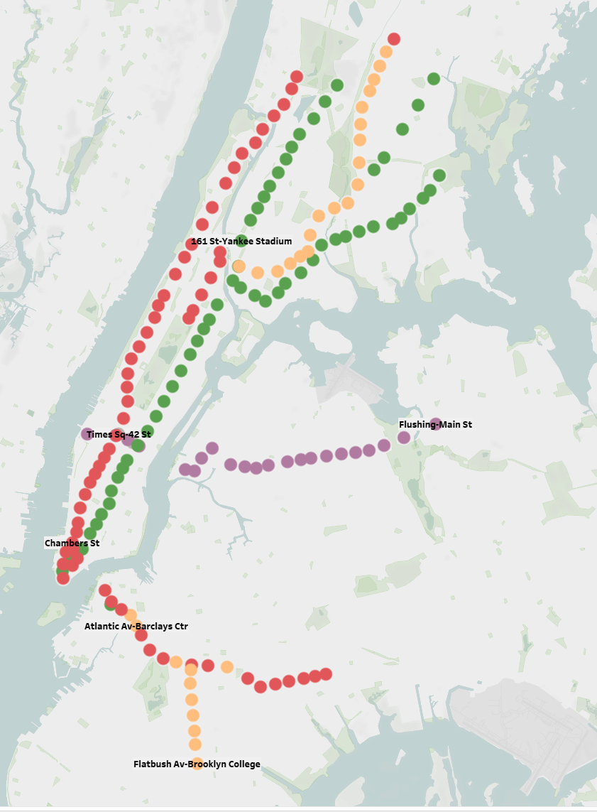
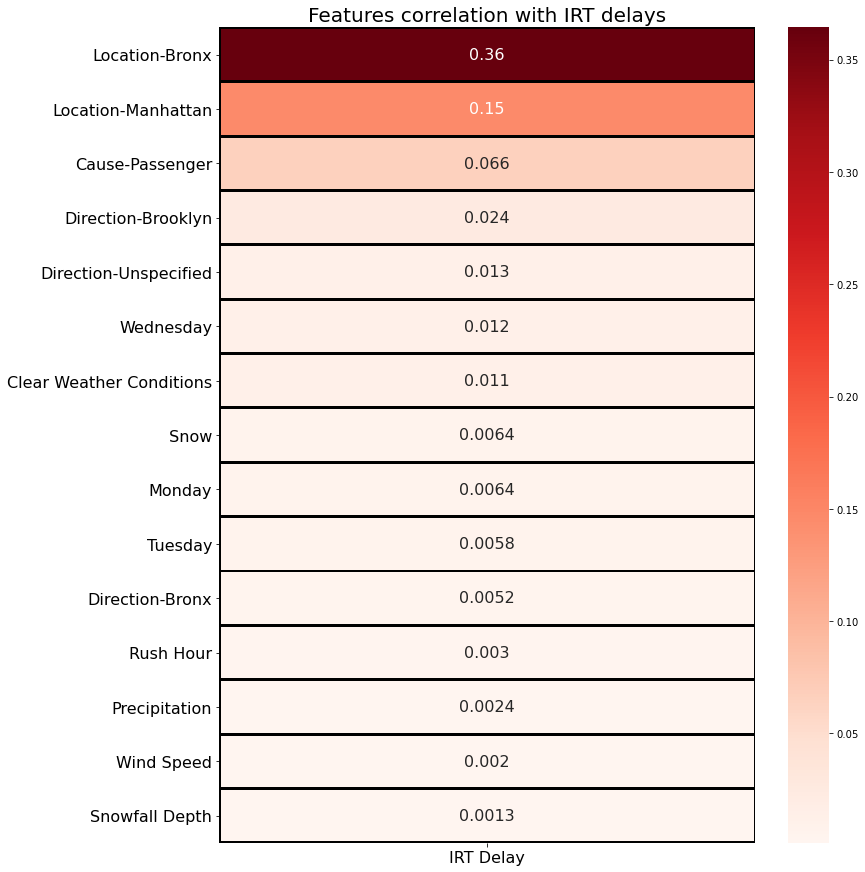
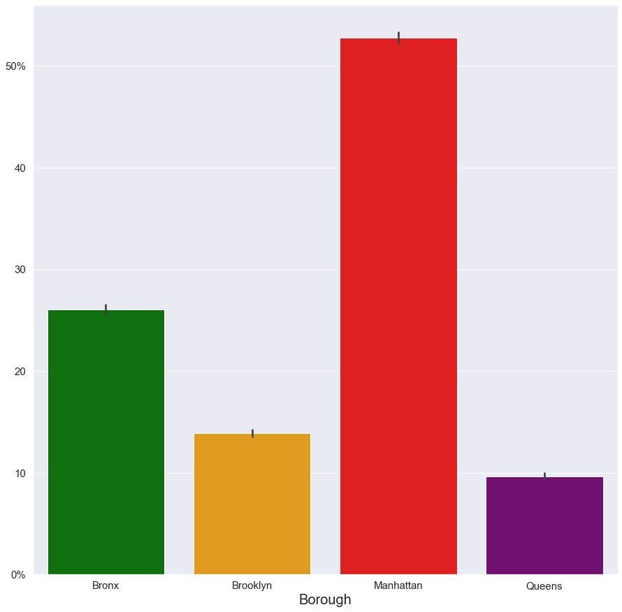
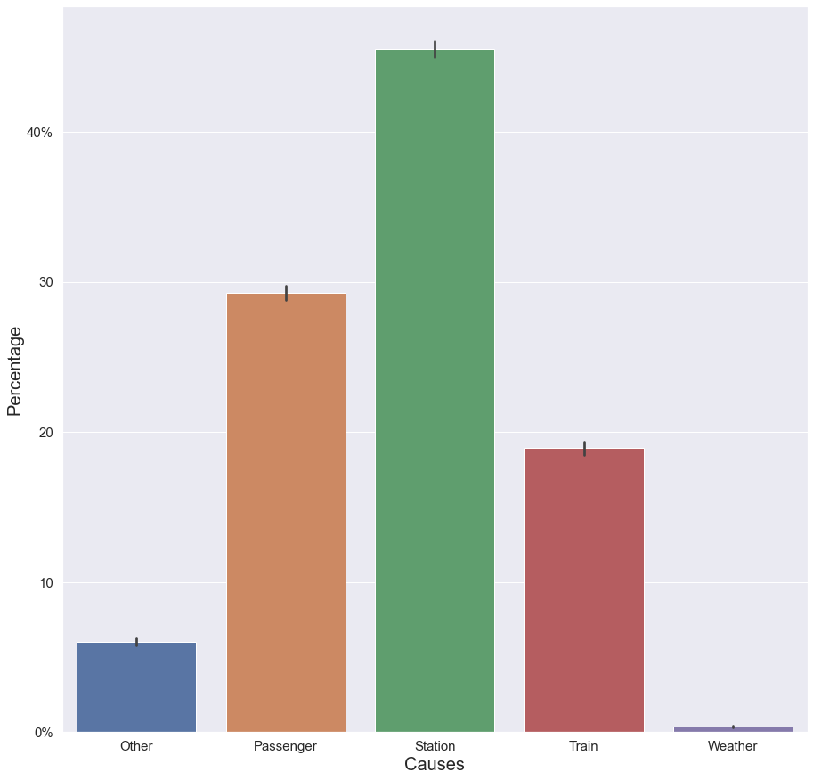
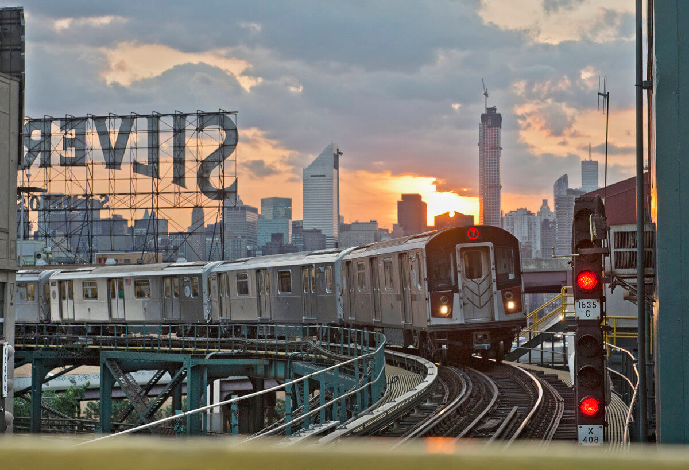
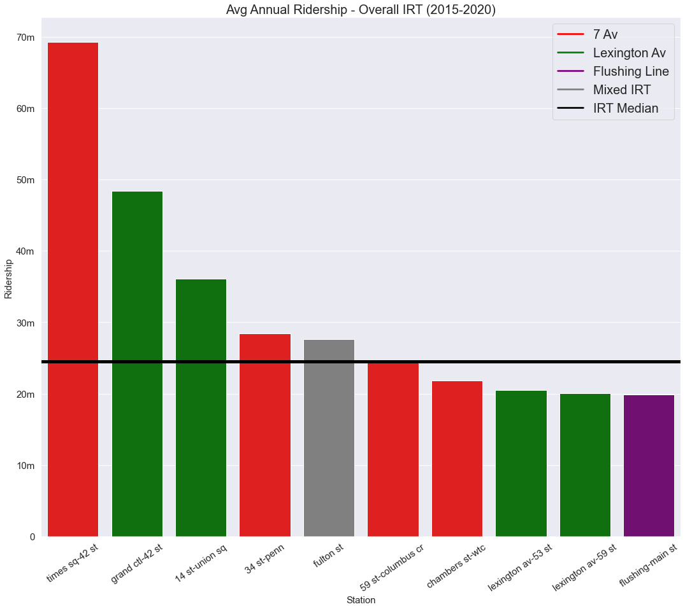
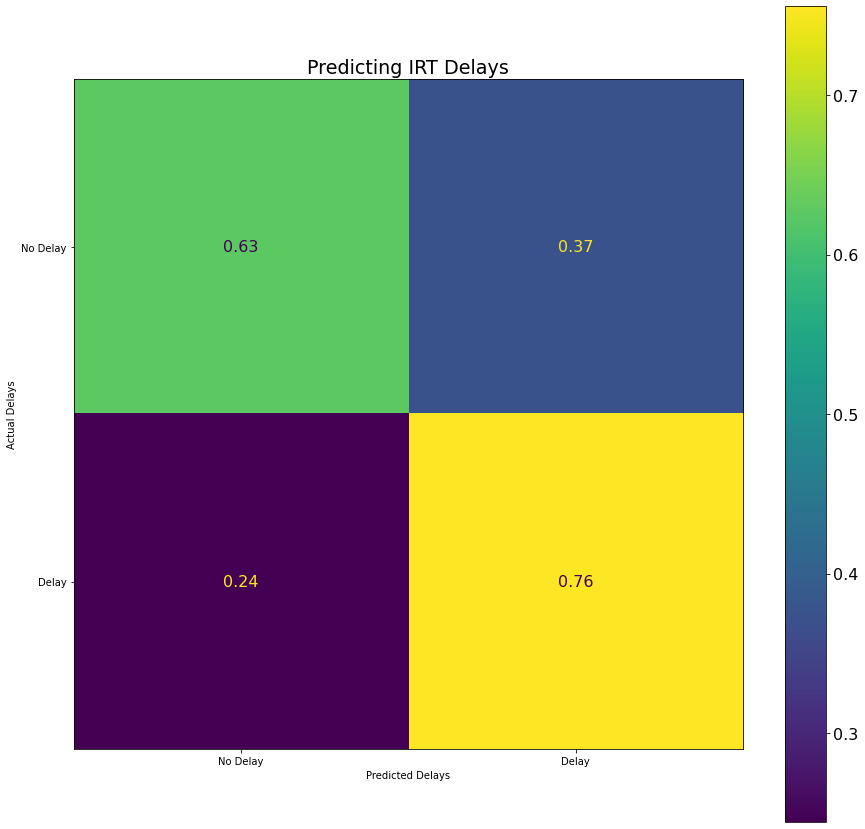

# MTA Service Delays on the IRT Line
A look at delays on the IRT Line 

# Overview

For my final project at Flatiron, I analyzed the data on delays from the [MTA Alerts Archive](https://mymtaalerts.com/archive). 

My goal was to find the main causes of delays in the Subway system, and see if we can pinpoint a location, station, area, etc. that might cause future delays. 

Image courtesy of [Flickr](https://www.flickr.com/photos/55167823@N07/12951714935)

# Business Problem
The business problem is straight forward. New Yorkers hate delays. They take time out of our day and make us both frustrated and late. Like many New Yorkers, in previous occupations and for school, I'd have to budget travel time with the idea that I will encounter a delay at some point. 

The NYT reported in 2017 that [delays cost $307 million annually](https://www.nytimes.com/2017/10/12/nyregion/subway-delays-lost-work-time-cost-new-york.html) in lost hours worked during the morning rush. 
  
For the purpose of this project, I selected The MTA itself and the NYS/Federal Government as stakeholders. For example, President Biden's recently promoted infrastructure bill likely has an earmarked amount towards the MTA. Where would that money be most usefully used? 

# Idea

As a proof of concept, I analyzed the delays to the IRT or Division A trains in the system. These are all the numbered lines and the 42nd street shuttle. [Here's more info on Wiki](https://en.wikipedia.org/wiki/A_Division_(New_York_City_Subway)). 
  
I then built a predictive model that can be used to determine delays at any given IRT station. 

 
Station locations on IRT line 
  
## Data
I stratified this to Jan 01, 2010-Sep 30, 2021. Then by Agency to just NYCT Subway and no escelator/elevator information. 

## Supplementary Data
I supplemented my analysis with:
* NYC Weather Data [from NOAA](https://www.ncdc.noaa.gov/cdo-web/datasets) 
* MTA Ridership Info from [MTA Website](https://new.mta.info/agency/new-york-city-transit/subway-bus-ridership-2020) 
* MTA Turnstile Info from [MTA Website](http://web.mta.info/developers/turnstile.html) 

## Data cleaning
To make my data useful, I did the following: 
  * Took out any "updates" so the same delay wouldn't be repeated 
  * Took out all planned service 
  * Took out station names for what station it was delayed at and which borough 
  * Turned all causes into features 
  * Turned all days into features 
  * Feature engineered time and weather variables 
  * Created a "delayed_irt" column that was a 1 or 0 if the delay affected a train on the IRT line 
    * As a note, this is a minority class, which will become relevant during modeling (about 35-40% 1s in about 87k points) 
  * Removed non-IRT stations from ridership data 
    
# Data Analysis 
## Visualizations 
Below are some visualizations: 

 
  Heatmap of features correlation to IRT delays 
  

 
  How frequently a delay is caused in each borough 
   
   
 
  Main causes of delays 

## Explanation 

The first chart are the main features in my data set that correlated to the IRT delays. Interestingly enough, this EDA said the Bronx as a location had the highest correlation to delays, more than double the correlation of Manhattan, which was the second-highest. This is likely due to the number of stations on the IRT line in the Bronx, but as we'll see in the next charts, most delays are actually not occuring in the Bronx. 
  
Manhattan has the highest count frequency for delays, nearly double what occurs in the Bronx and triple either Brooklyn or Queens. 
  
The final visualization shows the causes of each delay, per any given alert. The main cause by-far is something in the station. This includes: 
  * Emergency track maintenance 
  * Track fire 
  * Switch/signal problem 
  * Flooding 
  * Power outage 

With the main cause in the stations being signal/switch problems. This is a well-known issue throughout the NYC Subway system, which has really old signals and switches. These frequently cause delays in the stations which can include [complete service disruption](https://www.nbcnewyork.com/news/local/mta-switch-malfunction-wreaks-havoc-various-subway-lines-suspended/1523969/). 
  
Other notable causes were Passengers, who usually caused delays in one of three ways: 
  * Medical emergency 
  * Police action needed 
  * Being struck by a train 
  
...and the trains themselves, usually through door malfunctions or being removed from service for one reason or another .
  
 
  7 train with a signal shown on the right, passing by the iconic Silvercup sign in LIC, Queens 
  
## Ridership 
  
Finally, I looked at the ridership data for NYC from 2015-2020. As part of my proof of concept, I just looked at the top-10 most frequently used stations in the system, 9 of which are in Manhattan. I used these as my "test" subjects for my future model deployment. 
  
 
  
Times Square is, unsurprisingly, the behemoth station in the system in terms of ridership, with Grand Central being a distant second. 
  
Now, I hear some New Yorkers saying, "wait, Times Square doesn't *just* run IRT trains, though?" which, yes, that's correct. It has both Division A and Division B trains running through it. Same with several other stations on this chart. However, the way I wanted to look at this data didn't really lend itself to parsing out the ridership on the 1/2/3/7/S lines vs the lettered lines. After this proof of concept repo, I plan on going back into the lab and recreating this entire project for the whole system. So in the meantime, we apologize for the inconvenience, we appreciate your patience, and thank you for riding with MTA, New York City Transit. 
  
In all seriousness though, the way I parsed the data, it only accounted for delays at any given station on the IRT lines. So, while a lettered train might be delayed at 42 st, my model doesn't account for that and it was not part of the y-target for my model. Speaking of... 
  
# Modeling! 
  
So we have our data, we have our likely causes. Can we predict which stations will likely cause delays down the road? Well, as a Data Scientist (I feel like I can use that term now!), I'll certainly do my best. 
  
I ran Grid Search CV on several different model-types. The main y_target for my training data was IRT_delays, while the features accounted for all my x variables. 
  
## Logistic Regression 

The best overall model I came up on my imbalanced dataset with was a Logistic Regression model, which had an overall accuracy of about 67.72% on the imbalenced data with an F1 score of 65.63%. Not too shabby, but this was on imbalenced data. So naturally, I... 
  
## SMOTE and BNB 
  
I SMOTEd the data (love saying that), meaning I balanced the classes, and the best model with these metrics was Bernoulli Naive Bayes, at 67.82% overall accuracy and an F1 score of 65.07%. Not too shabby! 
  

  
## Model testing 
  
With my model trained, I deployed it on data where the new target was delays at a given station, which I had engineered earlier. My findings were generally consistent, and my BNB model is predicting overall accuracy of about 60% at most of these stations (with the exception of Flushing-Main St, which I suspect it's because Queens is an outlier-borough in the dataset) and succesful delays predictions of about 45-50% for each station (again, except for Flushing-Main St). 
  
# Conclusions 
  
With my analysis and model testing, I would like to recommend that station and signal upgrades should occur at the following stations to help ease delays: 
  * Fulton St 
  * Grand Central-42nd St 
  * 14 St-Union Sq 
  
## Next Steps 
  
The next steps are fairly clear. First, I want to deploy this as a Flask-App, likely with Heroku. So, keep an eye out for that! 
  
Next, I believe that with this analysis, I've prooved that an all-encompassing look of delays across the system (including the Staten Island Railway) can be done with the same process, and it will make my model perform better overall (assuming BNB is even still the best one at that point!). 
  
I think the main question after that will be whether I should do it for each subdivision (IRT, IND and BMT) or all three lines at once. Then do I train the model on the train-lines themself, or on the stations? I also have access to the MTA's Real-Time feed, though I've been having some trouble getting it into a readable, deployable form. But, if I'm able to use it, I want to collect data on delay lengths so I won't only be able to predict the % chance of a delay, but also the length it will last for. 
  
So many different directions to go, I'll be working on this steadily over the next year. I really hate delays, and although the MTA is technically no longer [in a state of emergency](https://gothamist.com/news/mta-has-been-state-emergency-four-years), it's unlikely the problem will get better any time soon. So, the best we can do is try to predict when these delays occur so we can avoid 'em! 
